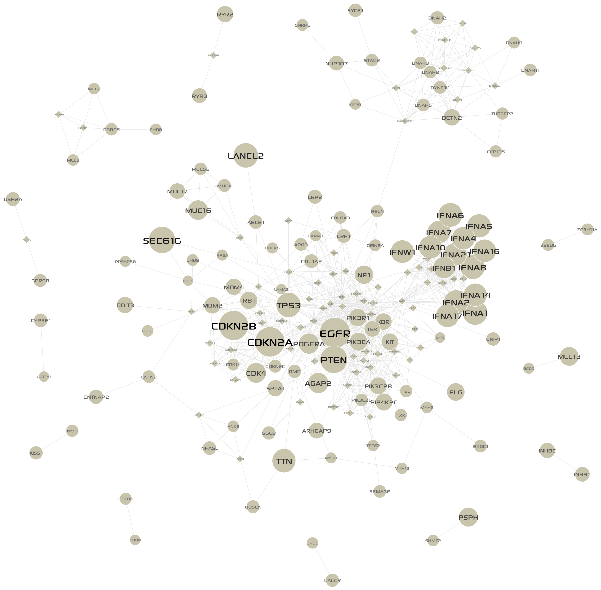

**********
Case Study
**********

High-throughput studies of tumor biology at multiple levels, including genome, transcriptome, and proteome, have been resulting in a greatly increased volume of cancer omics data. Given huge amount of cancer omics data, it is a major challenge to distinguish driver mutations from passengers, and to reveal functional relationships between them. One powerful approach to the challenge is to analyze data on the context of biological networks. For example, integration of mutation, copy number, and gene expression profiles with a biological interaction network has been proposed as an approach to identify functional cancer drivers, relying on the assumption that they will cluster on the network (:ref:`Bertrand et al., 2015 <be2015>`).

In this section, we demonstrate how MONGKIE can facilitate the study of structural pattern of altered genes in the TCGA study of Glioblastoma Multiforme (:ref:`Brennan et al., 2013 <br2013>`) on the `STRING <http://string-db.org/>`_ PPI network to identify candidate driver genes and core gene modules perturbed by them.

Cancer omics data
=================

Somatic mutations, DNA copy number alterations, and RNA-seq expressions level 3 data for TCGA GBM cases were obtained from the `UCSC Cancer Browser <https://genome-cancer.ucsc.edu/proj/site/hgHeatmap/#?bookmark=ce15f29a905207cbf3d0dbcdf9d35c18>`_.

.. topic:: TCGA GBM Datasets processed by UCSC Cancer Browser
    
    .. csv-table:: 
        :header: "Data Type", "Downloaded Data File"
        
        "Somatic Mutation", "TCGA_GBM_mutation_broad_gene-2015-02-24.tgz"
        "Copy Number", "TCGA_GBM_gistic2thd-2015-02-24.tgz"
        "RNAseq Expression", "TCGA_GBM_exp_HiSeqV2-2015-02-24.tgz"

Based on the 273 GBM cases with both somatic mutation and copy number information, each gene was considered altered if modified by a validated non-synonymous somatic nucleotide substitution, a homozygous deletion, or a multi-copy amplification. These somatic SNVs, indels, and called CNAs are combined to produce the gene-by-patient matrix M for gene alterations, where ``M(i;j)`` indicates whether the ``gene i`` is altered or not in the ``patient j``, then an alteration frequency score for each gene was calculated by counting the number of patients in whom the gene is altered.

For gene-level expression profiles, we produced the gene-by-patient matrix G for gene expressions, where ``G(i;j)`` represents the expression level, which is a logarithmic scale of upper-quartile normalized RSEM (:ref:`Li et al., 2011 <li2011>`) estimats in tumor, for the ``gene i`` in the ``patient j``.

Extraction of a GBM-altered network
===================================

We selected recurrently altered genes with somatic mutations in 6 or more patients, or CNAs in 9 or more patients from the alterations matrix (See above section). A total of 380 genes passed the frequency threshold. For each pair of those genes, we found all shortest paths in the STRING database (Confidence score > 900) with distance threshold 2, resulting in 175 altered genes and 815 linkers. To retain significant linkers only (:ref:`Cerami et al., 2010 <ce2010>`), we applied the hyper-geometric distribution test for local enrichment against the global degree of each linker within the background network (See next section for details). After Benjamini & Hochberg (aka FDR) multiple testing correction (p-value < 0.01), we finally extracted a GBM-altered sub-network with ``119 altered genes``, ``72 linkers``, and ``861 interactions`` between them. The visualization of the extracted network in MONGKIE is shown in Figure S3.1.

    
    Figure S3.1 GBM-altered network
    
    Altered genes represented by ``circles``, and linkers by ``diamonds``; alteration frequencies were mapped to node sizes.

Statistical test for significant linkers
========================================

Network clustering
==================

Results
=======

