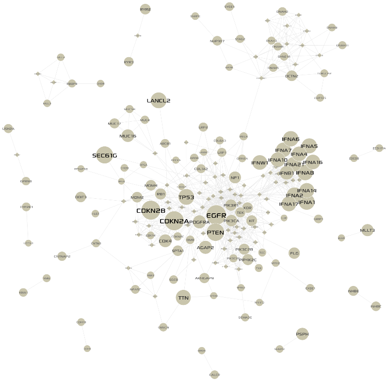
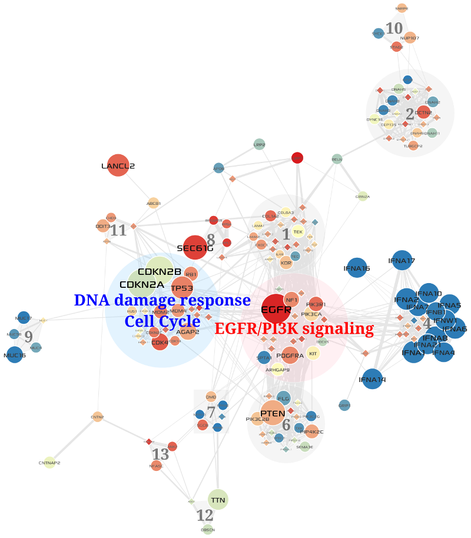

**********
Case Study
**********

High-throughput studies of tumor biology at multiple levels, including genome, transcriptome, and proteome, have been resulting in a greatly increased volume of cancer omics data. Given huge amount of cancer omics data, it is a major challenge to distinguish driver mutations from passengers, and to reveal functional relationships between them. One powerful approach to the challenge is to analyze data on the context of biological networks. For example, integration of mutation, copy number, and gene expression profiles with a biological interaction network has been proposed as an approach to identify functional cancer drivers, relying on the assumption that they will cluster on the network (:ref:`Bertrand et al., 2015 <be2015>`).

In this section, we demonstrate how MONGKIE can facilitate the study of structural pattern of altered genes in the TCGA study of Glioblastoma Multiforme (:ref:`Brennan et al., 2013 <br2013>`) on the `STRING <http://string-db.org/>`_ PPI network to identify candidate driver genes and core gene modules perturbed by them.

Cancer omics data
=================

Somatic mutations, DNA copy number alterations, and RNA-seq expressions level 3 data for TCGA GBM cases were obtained from the `UCSC Cancer Browser <https://genome-cancer.ucsc.edu/proj/site/hgHeatmap/#?bookmark=ce15f29a905207cbf3d0dbcdf9d35c18>`_.

.. topic:: TCGA GBM Datasets processed by UCSC Cancer Browser
    
    .. csv-table:: 
        :header: "Data Type", "Downloaded Data File"
        
        "Somatic Mutation", "TCGA_GBM_mutation_broad_gene-2015-02-24.tgz"
        "Copy Number", "TCGA_GBM_gistic2thd-2015-02-24.tgz"
        "RNAseq Expression", "TCGA_GBM_exp_HiSeqV2-2015-02-24.tgz"

Based on the 273 GBM cases with both somatic mutation and copy number information, each gene was considered altered if modified by a validated non-synonymous somatic nucleotide substitution, a homozygous deletion, or a multi-copy amplification. These somatic SNVs, indels, and called CNAs are combined to produce the gene-by-patient matrix M for gene alterations, where ``M(i;j)`` indicates whether the ``gene i`` is altered or not in the ``patient j``, then an alteration frequency score for each gene was calculated by counting the number of patients in whom the gene is altered.

For gene-level expression profiles, we produced the gene-by-patient matrix G for gene expressions, where ``G(i;j)`` represents the expression level, which is a logarithmic scale of upper-quartile normalized RSEM (:ref:`Li et al., 2011 <li2011>`) estimats in tumor, for the ``gene i`` in the ``patient j``.

Extraction of a GBM-altered network
===================================

We selected recurrently altered genes with somatic mutations in 6 or more patients, or CNAs in 9 or more patients from the alterations matrix (See above section). A total of 380 genes passed the frequency threshold. For each pair of those genes, we found all shortest paths in the STRING database (Confidence score > 900) with distance threshold 2, resulting in 175 altered genes and 815 linkers. To retain significant linkers only (:ref:`Cerami et al., 2010 <ce2010>`), we applied the hyper-geometric distribution test for local enrichment against the global degree of each linker within the background network (See next section for details). After Benjamini & Hochberg (aka FDR) multiple testing correction (p-value < 0.01), we finally extracted a GBM-altered sub-network with ``119 altered genes``, ``72 linkers``, and ``861 interactions`` between them. The visualization of the extracted network in MONGKIE is shown in Figure 3.1.

    
    Figure 3.1 GBM-altered network
    
    Altered genes represented by ``circles``, and linkers by ``diamonds``; alteration frequencies were mapped to node sizes.

Statistical test for significant linkers
========================================

It is necessary to assess the probability that linker genes, which are not altered but extracted guilt by association, would connect to the observed number of altered genes by chance alone. The simplest and most widely used statistical test for such purpose is the ``hyper-geometric distribution`` test, where ``successes in sample``: number of edges connecting the linker to altered genes in the extracted network (local degree), ``successes in background``: global degree of the linker in the background network, ``population size``: total number of genes in the background network, ``sample size``: number of altered genes in the extracted network.

Network clustering
==================

To give weights to the extracted network, we calculated Pearson Correlation Coefficients of expression levels in the expressions matrix (See above section) among all pair-wise interactions between genes in the extracted network, and then assigned the PCCs to weights of edges in the network. Next, we used a highly efficient network clustering algorithm, MCL (:ref:`Van Dongen, 2000 <va2000>`), to cluster the weighted network into a set of gene modules. The visualization of the result is shown in Figure 3.2. Each module consists of gene set that are both topologically close in the PPI network, and highly correlated by expression abundance change in tumor conditions.

    
    Figure 3.2 Core gene modules in the GBM-altered network
    
    Gene alteration frequencies in all GBM cases were mapped to node sizes; mean expression levels of each gene over cases of the *Mesenchymal* subtype were mapped to node colors; expression correlations in tumor cases were mapped to edge thicknesses. Two critical modules (See Results) are represented by different colors (one is ``blue``, another is ``red``; the others are ``gray``)

Results
=======

Two of the top 5 largest gene modules that are identified by network-based multi-omics (somatic mutations, copy number variations, and RNA expressions) analysis of TCGA GBM cases corresponded very closely to critical signaling pathways prior known to GBM biology. First one corresponded to the components of the ``AKT/PI3K/mTOR signaling`` pathway, including ``EGFR``, ``PDGFRA``, ``PIK3CA``, and ``PIK3R1`` (see Figure 3.3), and second one to the components of the ``DNA damage response`` and ``Cell Cyle`` including ``TP53``, ``CDKN2A/B``, ``CDK4``, ``MDM2/4`` and ``RB1`` (see Figure 3.4).

In summary, we performed an integrated network analysis to identify core network modules in the TCGA study of Glioblastoma Mutiforme, and the result revealed that our tool can be used to automatically identify cancer driver genes and core gene modules sharing structural pattern with those genes in a PPI network, thus to capture critical pathways that play important roles in tumor genesis.

