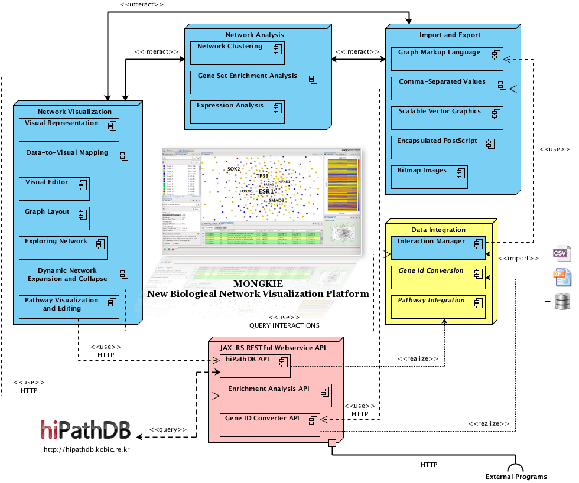
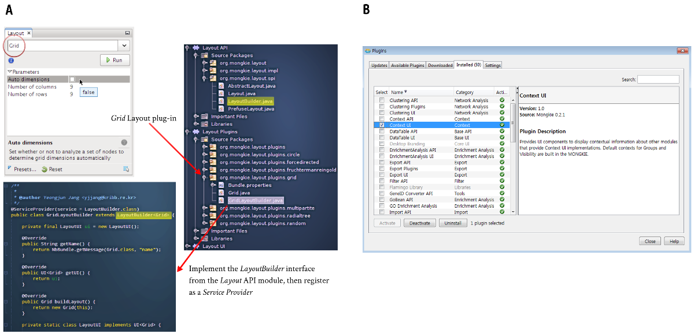

********************
Plug-in architecture
********************

MONGKIE is a java-based application built on top of the `NetBeans Rich Client Platform <https://netbeans.org/features/platform/index.html>`_ that supports plug-in programming architecture, thus it is easy to implement various new plug-ins with additional functionalities. An overview of its modular architecture is given in :numref:`software-architecture`.

    
    Schematic overview of the plug-in architecture implemented in MONGKIE

Based on its extensible architecture, MONGKIE provides core APIs (Application Programming Interfaces), SPIs (Service Provider Interfaces), and UI widgets for the base functionalities, such as graph visualization, network analysis, data integration, and many out-of-the-box supports that enable to build your own plug-ins onto the platform.

For example, The software module for :doc:`../network_visualization/graph_layouts` provides well-defined APIs, SPIs and UI components that can be utilized by plug-in developers (See :numref:`plugin-development` A). Therefore, if you want to add a new layout algorithm into the MONGKIE, you only need to implement the logic of the layout algorithm without having to worry about other things like UI components, program states, window management, event handling, and data persistence and so on. All of these fundamental features for developing plug-ins are provided out of the box. This approach can allow a great deal of flexibility in the building various improvements of existing modules as well as the introducing of new functionalities or tools.

    
    Development and Management of Plug-ins
    
    **(A)** an example of developing a layout plug-in implementing a new algorithm. **(B)** UI for plug-ins management.

MONGKIE also provides a GUI (Graphical User Interface) shown in :numref:`plugin-development` B, Plug-in Manager, in order to facilitate the management of different plug-ins. Hence, users can install, update, remove, activate, or deactivate individual plug-ins through the integrated UI, this allows the customization of the application functionalities according to their needs.
