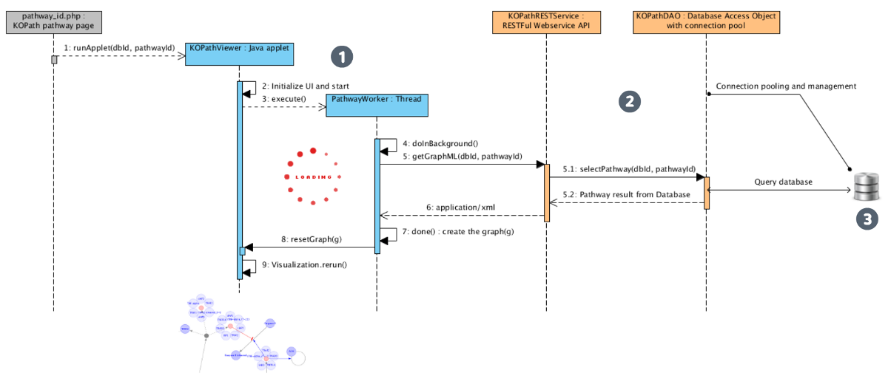

***********************
RESTFul Web service API
***********************

The multi-tiered system is applied for abstracting remote data sources and separating control logics from the data and presentation layers to improve data integrity and accessibility. We put retrieval logics for the remote data at the middle-tier, which enables to control database connections and provide unified and maintainable data access. RESTFul Web Service APIs, which are at the middle-tier, are implemented using the `JAX-RS <https://jax-rs-spec.java.net>`_ technology - the Java API for RESTful (Representational State Transfer) Web Services. Based on these web APIs, MONGKIE provides the functionality that allow users to access our integrated data sources and services from outside of the platform in a programmatic fashion through any REST clients, including Java Applet, Python or Ruby scripts (See :numref:`software-architecture`).

    
    Overview of the 3-tier system implemented in hiPathDB (ref:`Yu et al., 2012 <YuSe12>`)
    
    **(1)** A REST client written for pathway visualization (blue colors), **(2)** RESTFul Web service at the middle tier (orange colors), **(3)** Relational database backend.

As an example, the implementation and usage of the hiPathDB (ref:`Yu et al., 2012 <YuSe12>`) RESTful Web Service API is shown in :numref:`multi-tiers`. hiPathDB APIs allow researchers to retrieve data from hiPathDB database by offering methods to get pathways given their names, or get member genes given a list of pathways, and some others.
