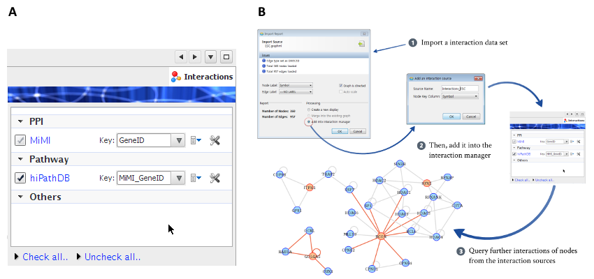

*******************
Interaction Manager
*******************

In addition to biological pathways, there are other types of biological interactions that are well modeled by simple binary, pair-wise graphs, such as PPIs, TF-target, miRNA-target and genetic interactions, and they are also essential for the network analysis of genomic data. MONGKIE provides a elegant way to use these types of network as background networks for the exploratory network-based analysis and visualization, through the Interaction Manager UI, shown in :numref:`interaction-manager` A.

    
    Interaction Manager
    
    **(A)** Interaction Manager UI. **(B)** demonstrates the procedure of dynamic network construction starting with a small part of genes of interest (orange nodes).

Imported and managed interaction data sources can be utilized for various exploratory and analytical purposes, such as network generation from a scratch by search query, dynamic network exploration, expansion and filtering of interactions by their sources. For example, there are cases when the size of a interaction network is so huge that it is impossible to handle and visualize the complete network at once. It is recommended for such situations to follow the approach of a classical top-down exploration, in which rather than display the entire network in one display, initially start with a small part of nodes in the network, e.g. deferentially expressed genes, and then iteratively build a larger network by allowing the user to successively expand particular nodes of interest with their further interactions and neighbors.

The procedure for this strategy of top-down exploration provided by the Interaction Manager is shown in :numref:`interaction-manager` B. It allows the user to expand interactions through the context-sensitive right-click menus on a selected nodes of interest (orange nodes), as well as just to connect existing nodes using the interaction dataset from a data source by selecting the check-box of that source in the interaction manager UI. Later, the user may delete neighbors out of the interest to reduce complexities of the network such that he/she focuses on the region of interest. Furthermore, each newly added node resulting from a expansion action is placed in an appropriate position with an animation, well incorporated into the force-directed layout algorithm (:ref:`Frick et al., 1999 <Fric99>`, :ref:`Heer et al., 2005 <Heer05>`), and this allows the user to easily preserve the so-called mental map (:ref:`Misue et al., 1995 <Misu95>`) during exploration of the network.

Users can import more their own binary interaction dataset into the interaction manager either from files using standard formats - e.g. GraphML and CSV files - or from remote databases. Additionally, visual styles of each interaction source can be fully customized through the Visual Style editor, and they will be persisted, the latter means that customized visual properties of edges from the interaction source as well as imported interaction dataset themselves is locally stored and will be available for styling edges on the next run of the application.
