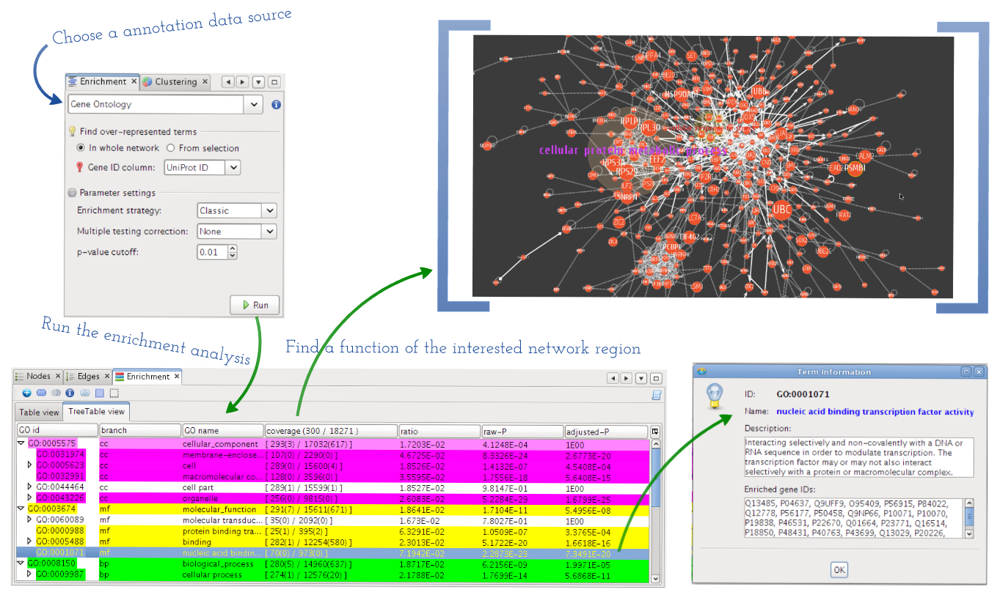

****************************
Over-representation analysis
****************************

A group of interesting genes in the biological network, e.g. a module of potentially related genes has been found by the :doc:`./network_clustering`, may be investigated to find biological pathways or other functional categories like GO (:ref:`Gene Ontology Consortium, 2004 <Gene04>`) terms, where they are significantly over-represented. This approach, so-called 'enrichment analysis', is widely used in order to study the gene set for their over-representation in certain annotation classes that are usually related to biological functions of those genes (:ref:`Huang et al., 2009 <HuSL09>`).

    
    GO over-representation analysis
    
    This demonstrates the procedure of enrichment analysis, and visual annotation of relevant nodes or regions (e.g. clusters) in the network with significantly over-represented GO terms.

MONGKIE provides a pipeline for this analysis, shown in :numref:`enrichment-analysis`, where researchers perform a statistical test for enrichment or depletion using the GO categories, in order to identify over-represented functional terms with statistically significance from the selected set of interesting genes in the certain network region. The result of analysis is displayed in table views with both a list of resultant functional terms and also statistics of the enrichment analysis, including number of enriched terms, number of population genes, number of query genes, and detailed information about each annotation term. In the result table, each row of resultant term has a background color that is mapped to its corresponding p-value - that was calculated using the hyper-geometric testing, and might be adjusted by one of following multiple testing correction methods: Bonferroni, Bonferroni-Holm, Benjamini-Hochberg, or Benjamini-Yekutieli - and the set of resultant term can be reduced based on user's cut-offs and ranked by their statistical p-values.

Another optimized way to show the result of enriched functional terms in the hierarchical structure, e.g. Gene Ontology, is to display them in a tree table. In the tree table view, intermediate terms for tree hierarchy are automatically included, and users can expand or collapse any sub-tree in the view. Therefore it allows the user to interactively investigate terms according to specific biological complexity within the hierarchical structure as well as their significance.

Once a list of resultant term is displayed in a tabular format, users can select significant terms of interest, then visualize the group of relevant nodes or regions annotated with those terms in the network context by mapping distinguishable visual aspects to them. This visual mapping of functional terms in the context of the network has the distinct advantage of allowing the user to quickly identify by eye both biological functions of certain parts and also higher-order interactions between those parts in the network that would not be obvious without this type of visual representation.
