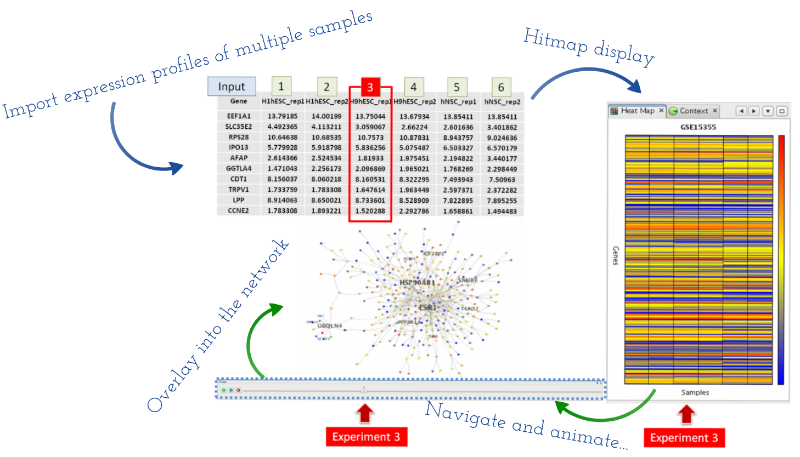

***********************
Gene expression overlay
***********************

Gene expression data obtained by micro-array experiments or RNA-seq techniques can provide powerful insights into underlying cellular states and dynamics when they are well integrated into the context of biological networks. Therefore, overlaying expression profile data onto a visualized network is an essential way in identifying a set of genes or proteins that share a related pattern of expression under a particular condition - eg. co-regulated gene sets and their interactions in a certain disease sample - or capture dynamic changes of their expression levels over a range of time points or different conditions (:ref:`Gehlenborg et al., 2010 <Gehl10>`). For these analyses, we require tools that allow users to visually represent expression profiles of the nodes in the network according to their expression level, thus better perceive the dynamic mechanism of a underlying biological system being guided by visualized expression patterns or changes.

MONGKIE provides powerful functionalities for visual analyses of high-throughput omics data in the context of networks, in particular for the gene expression data analysis of time series or multiple conditions. It supports dynamic visual representations, including a color gradient, size, and label of relevant nodes, that are easy to separate and interpret independently in order to depict the corresponding expression profile ratio of gene or protein nodes. Once expression profiles are imported as data attributes of nodes using the CSV file format, then a heat map visualization, which is used in a wide range of tools for the process of gene expression visualization (:ref:`Gehlenborg et al., 2010 <Gehl10>`) appears to display those expression data as a ratio-based graphical matrix, as well as incorporated within the graphical representation of nodes in the network (see :numref:`expression-overlay`).

An important challenge for expression data analysis is to interpret gene expression data produced from more than one condition, for example, time series experiments, or multiple perturbation studies. Therefore, it is necessary to consider all time points or conditions in order to detect temporal patterns and their changes in gene expression profiles whose values vary over time or different condition. This requires a selective or sequential visualization of multiple expression levels in the network context. MONGKIE allows users to incorporate such dynamics of gene expression profiles into the loaded network visualization by offering a way to change the visual mapping - e.g. color, size - of nodes to reflect the expression levels of a particular time point or condition according to the user selection.

    
    Overlaying of multiple expression profiles
    
    This demonstrates the procedure of overlaying of gene expression data from multiple experiments onto genes in the network, and the UI for capturing dynamic changes of their expression levels over a range of different experiments.

:numref:`expression-overlay` illustrates an example of this process, where gene expression profiles from multiple micro-array experiments in six cell lines were loaded into the heat map display, and also mapped on corresponding nodes in the network. A expression level of a particular experiment can be navigated using a sliding bar UI on the bottom of the window, and also the navigation process can be animated, as introduced in some tools (:ref:`Hu et al., 2013 <HuZC13>` and :ref:`Kincaid et al., 2008 <KiKC08>`), by automatically switch to visualization of the next experiment with a predefined time interval. This is well suited to investigating by eye changes of expression levels within a group of interesting genes - e.g. genes that share a same functional term, members of a network cluster, or deferentially expressed genes - over given experiments. Furthermore, by arranging visualization windows in a grid (see :doc:`../user_interface`), one can in parallel compare multiple visualizations of the same network, where each visualizes for its navigating experiment - known as the 'small multiples' approach (:ref:`Gehlenborg et al., 2010 <Gehl10>`).
