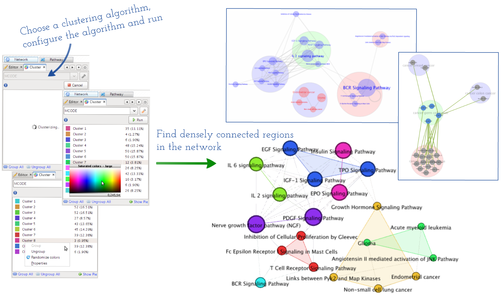

******************
Network clustering
******************

Fundamentally network-based approaches in systems biology are based on the hypothesis that biological entities rarely act alone in the cell, instead they interact spatiotemporally with others, forming modules, in order to perform specific cellular functions (:ref:`Hartwell et al., 1999 <Hart99>` and :ref:`Alberts et al., 1998 <Albe98>`). Graph-based clustering algorithms that are mainly developed in graph theory and recently computational systems biology have been successfully applied to the study of detection of protein complexes (:ref:`Krogan et al., 2006 <Krog06>`) or families (:ref:`Enright et al., 2002 <Enri02>`), or identification of functions of uncharacterized proteins (:ref:`Bader et al.,2002 <Bade02>`), or extraction of co-expressed clusters from co-expression networks (:ref:`Lee et al., 2004 <LeeH04>`), etc., and shown to obtain good performances for extracting such modules from a variety of biological interactions.

These so-called 'network clustering' methods are also known to be less susceptible to inherent false-positives and more accurately predict modules made up of functionally relate nodes rather than conventional iterative pair-wise clustering, where individual relationship - e.g. sequence similarity, co-expression - between two biological entities is investigated without considering structural patterns in their interactions with neighbors (:ref:`Freeman et al., 2007 <Free07>`).

MONGKIE currently incorporates two popular structure-based network clustering algorithms, including MCODE (Molecular COmplex DEtection algorithm), MCL (Markov CLustering algorithm), and these make it easy to find densely inter-connected, thus functionally related nodes in biological interactions, exploit both local and also global structural patterns, and visually map them onto the network. MCODE is a graph theoretic clustering algorithm for finding molecular complex in large protein interaction networks (:ref:`Bader and Hogue, 2003 <BaHo03>`). The MCODE plugin, which is implemented by porting from the pre-existing plug-in in Cytoscape (:ref:`Shannon et al., 2003 <Shan03>`), identifies clusters by finding regions of significant local density. MCL is a fast and scalable unsupervised clustering algorithm for graphs based on simulation of the flow in the graph (:ref:`Van Dongen, 2000 <VanD00>`). Because MCL is a robust state-of-the-art general purpose clustering algorithm for large graphs, it can be applied to any complex biological networks, e.g. protein functional relationship network to look for candidate cancer driver mutations and relevant functional modules they belong to (:ref:`Wu et al., 2010 <WuFS10>`).

    
    Network Clustering
    
    This demonstrates the procedure of identification network clusters, organization them onto the network with distinct visual schemes, and how nodes in the same cluster are laid out coherently.

One can define resultant network clusters (or modules) as groups, therefore they, as described in :doc:`../network_visualization/exploring_network`, can be visually organized and laid out onto the network with distinct visual schemes, as well as displayed in a tabular format. As shown in :numref:`network-clustering`, each cluster and its members are visualized with a distinct color and shape according to their cluster membership, also laid out using the optimized force-directed layout algorithm that automatically attracts each member in a cluster while repelling other clusters. This helps users to visually interpret the coherence of clusters in the context of the network, that cannot be easily obtained by simply examining lists of clusters or their membership. Cluster nodes in the network can then be manipulated just like other general nodes for any exploratory purposes, e.g. one can select, then drag them in order to place in desired positions. One also can create a new visualization for a sub-network made up of nodes and edges in a cluster.

These features of network clustering and grouping in MONGKIE can facilitate to analyze or visualize the large data set of biological interactions in a more modular way that can provide biological insight into both local and also global structures in networks between biologically related nodes - e.g. a pathway affected by mutated genes, proteins belonging to a same complex or family, or cross-talk among biological pathways etc.
