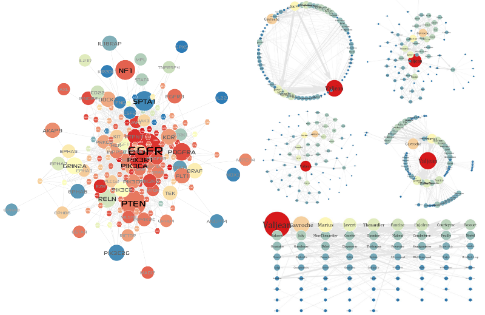

*************
Graph layouts
*************

Graph layout algorithms are used to place graph nodes and edges in various geometric distribution for the clarity and readability of networks such that the number of edges crossing minimized and that the layout represents the overall structure of the network legibly.

A variety of state-of-the-art layout algorithms are implemented in MONGKIE, including Circular, Grid, Fruchterman-Reingold (:ref:`Thomas et al., 1991 <Thom91>`), Radial Tree (:ref:`Book et al., 2001 <BoKe01>`), and Force-Directed (:ref:`Frick et al., 19999 <Fric99>`) layouts, both for efficiency and quality (see :numref:`graph-layouts`).

    
    Graph Layouts
    
    A variety of state-of-the-art layout algorithms are implemented in MONGKIE, including Circular, Grid, Fruchterman-Reingold, Radial Tree, and Force-Directed.

Like most of other typical network visualization softwares, we try a force-directed layout first because this layout can usually well organize most biological networks based on the non-deterministic algorithm that lets forces between nodes influence the position of the node in the network. All nodes exert repulsive force on the others whereas connected nodes are attracted to each other. After several iterations in which the positions are adjusted according to the calculated force, the layout stabilizes, keeping edge-crossings to a minimum (:ref:`Herman et al., 2000 <Herm00>` and :ref:`Heer et al. 2005 <Heer05>`). It also visually animate the process for laying out the network so that one can watch nodes in the network incrementally being placed in optimum positions and can terminate the algorithm when a good layout is obtained. However, this layout quickly becomes inadequate if the size and complexity of network are too larger to handle and interact. For such cases, MONGKIE provides an opportunity to go without animations or to choose other faster but simpler one - e.g. circular, grid etc.

Each layout algorithm can be easily started, canceled, and customized through the unified layout control UI. Highly configurable layout algorithms also allow the user to change layout settings in real-time, and therefore dramatically increase user feedback and experience. For instance, settings of the force-directed layout, including gravity, spring and forces, can be configured and immediately applied even while the algorithm is running.

In addition to automatic layout algorithms, MONGKIE offers another way to interactively change the layout of the network by manually dragging each node or user-defined groups into any positions, and this is very useful in fine-tuning the automatic layout or emphasizing important nodes or biologically significant regions in the network by geometrically separating them from other parts.
