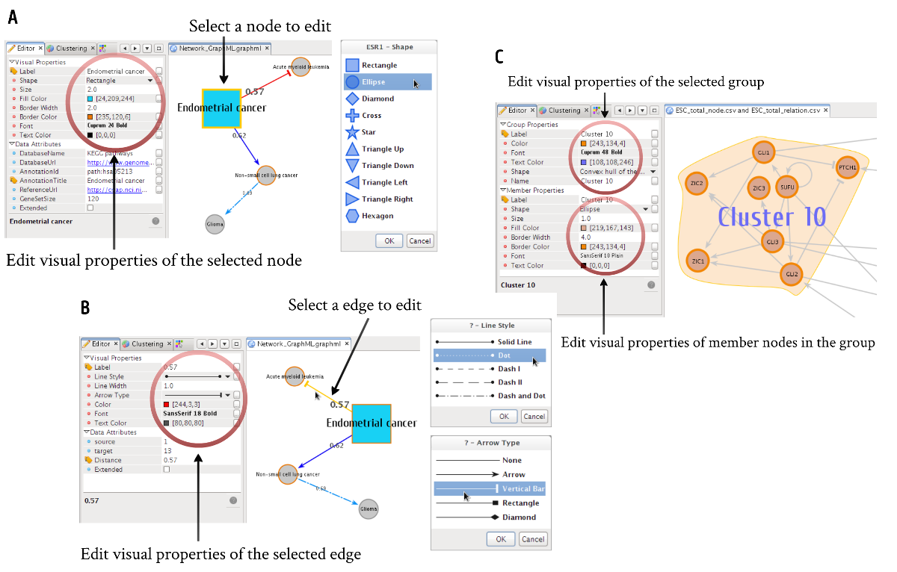
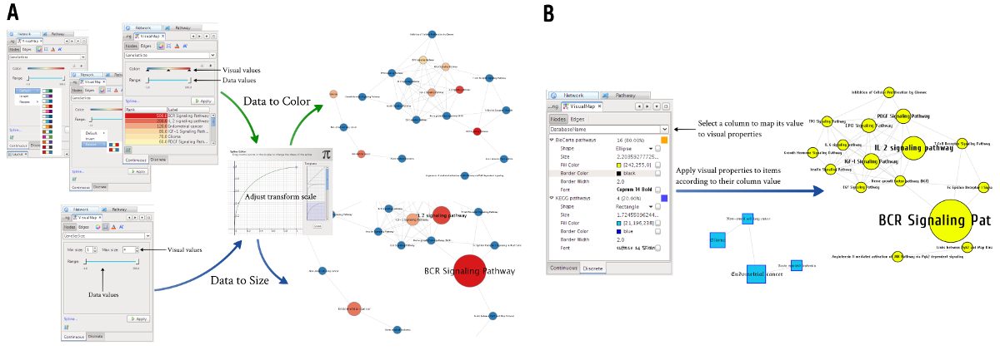

*******************************************
Visual editor UI and Data-to-Visual mapping
*******************************************

Every component - nodes, edges, and groups - of the visualization model has a set of visual properties, including label text, text font, stroke, shape, size, color, line shape and width etc. These visual styles of them can be fully customized individually through the integrated Visual Editor UI which allows the user to edit them in any way the user desires with numerous predefined palettes. Actual UIs for editing visual properties of nodes, edges, and groups are shown in :numref:`visual-editors`.

    
    Visual Editor UIs
    
    Visual editor UIs for **(A)** nodes, **(B)** edges, and **(C)** groups with their members.

Each component in the network can have associated data attributes possibly describing visual properties of them. In addition to selective and manual editing of visual styles, MONKGIE also provides a very useful way to automatically set visual aspects of components based on their data attributes. This continuous or discrete Data-to-Visual attribute mapping allows researchers to synoptically view multiple types of data in a network context (see :numref:`data-to-visual-mapping`). Data-to-Visual mapping lets the user, for example, load omics data from various high-throughput experiments, e.g. expression profiles, and visually project them into the network by automatically transforming data to some graphical attributes, e.g. color, size, visibility etc.

    
    Continuous and discrete Data-to-Visual Mapping
    
    Using an example network that are modeling cross-talks between biological pathways, **(A)** the number of genes in each pathway was continuously mapped to visual properties (size and color) of the corresponding pathway node. **(B)** data sources (KEGG or BioCarta) of each pathway were discretely mapped to node colors.
