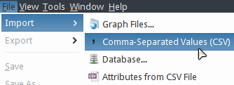
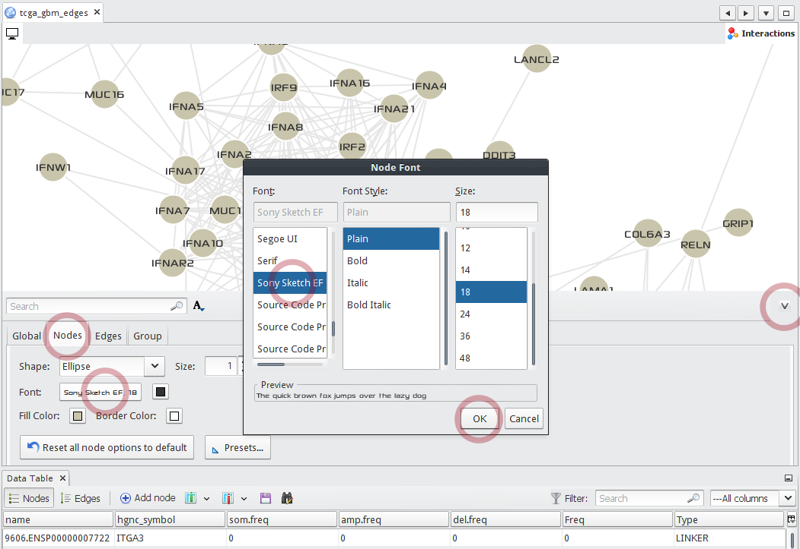
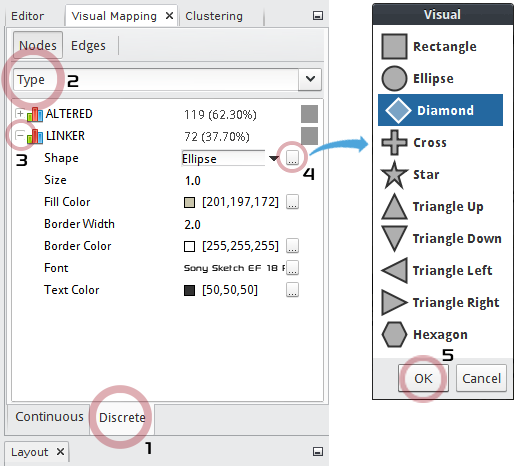
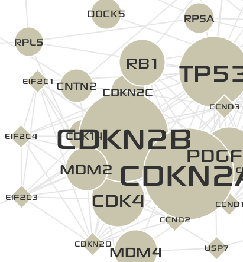

********
Tutorial
********

This section provides a step-by-step tutorial for the :doc:`./case_study`.

.. note::
    
    Input data files to be imported into the MONGKIE in this tutorial were generated by the :download:`extractAlteredNet_GBM.R </assets/extractAlteredNet_GBM.R>`. Refer to :doc:`./case_study` for details about the method. Briefly, starting with somatic mutations, CNAs, and gene expression data sets downloaded from `UCSC Cancer Browser <https://genome-cancer.ucsc.edu/proj/site/hgHeatmap/#?bookmark=ce15f29a905207cbf3d0dbcdf9d35c18>`_, the :download:`R script </assets/extractAlteredNet_GBM.R>` does the following tasks.
    
    * Calculate expression log2FCs of each gene in normal vs. tumor conditions.
    * Calculate expression means of each gene in 4 GBM subtypes.
    * Extract a sub-network of altered (somatic mutation or CNV) genes in `STRING <http://string-db.org/>`_.
    * Calculate expression correlations between each pair of genes in the extracted network.
    * Write vertices, edges, and expression related data files.
    
    You can download the R script and generated input files in :download:`supplementary_data.zip </assets/supplementary_data.zip>`.

Import a GBM-altered network
============================

To import a GBM-altered network from 2 CSV files for nodes and edges,

* Select :menuselection:`File --> Import --> Comma-Separated Values (CSV)`, then a wizard window will guide you to remaining steps.

* Choose :download:`tcga_gbm_vertices.csv </assets/tcga_gbm_vertices.csv>`, and set **ID column** to ``name``, **Label column** to ``hgnc_symbol``, then click the **Next** button.
.. image:: ./images/import_node_table_step.png

* Choose :download:`tcga_gbm_edges.csv </assets/tcga_gbm_edges.csv>`, and set **Source column** to ``from``, **Target column** to ``to``, then click the **Finish** button.
.. image:: ./images/import_edge_table_step.png

* A report dialog finally shows the summary of the imported graph, including number of nodes and edges, type of graph, issues occurred during the importing process etc. Click the **OK** button.
.. image:: ./images/import_report.png

Data-to-Visual mapping
======================

:doc:`Data-to-Visual mapping <./network_visualization/visual_editing>` allows you to map data attributes of nodes or edges to various visual styles.

* (Optional) Before proceeding to further steps, change the default font for nodes to ``Sony Sketch EF`` that was used in figures in the :doc:`./case_study`.
  
  .. note:: To use the ``Sony Sketch EF`` font, you should download and install it on your system. It is available at `here <http://www.fonts2u.com/sony-sketch-ef.font>`_.
  
  * To open the **Display Options** panel, click the **up-arrow button** in the bottom-right of a network display window.
  * Select the **Nodes** tab, and click the **Font name** button, and choose a font *name*, *style*, and *size*, then click the **OK** button.
  * To close the **Display Options** panel, click the **down-arrow button** in the top-right of the panel.

* To map the alteration freq. of genes to the sizes of corresponding nodes,

  1. Select the **Visual Mapping** window at the top-left of the main application.
  2. Select the **Nodes** tab button.
  3. Select the **Node size** icon.
  4. Choose the ``Freq`` data attribute to map in the drop-down list.
  5. Click the **Spline...** button to open the **Spline Editor**.
  6. Choose a pre-defined scale function.
  7. Adjust the transform scale to make more frequently altered genes be magnified.
  8. Close the **Spline Editor**.
  9. **Apply** the data-to-visual mapping.

.. image:: ./images/freq_to_node_size.png

* Now the network looks like the following:
.. image:: ./images/freq_to_node_size_result.png

* Now, you will map different shape to :abbr:`linker (Not altered genes but extracted guilt-by-association)` nodes using the discrete Data-to-Visual mapping.

  1. Select the **Discrete** tab at the bottom of the **Visual Mapping** window.
  2. Choose the ``Type`` data attribute of **Nodes** to map in the drop-down list.
  3. Expand the ``LINKER``, then various editors for visual styles will be shown.
  4. In the **Shape** filed, click the ``...`` button to show up the node shape chooser.
  5. Choose the ``Diamond`` shape, and click the **OK** button.

* Now the network looks like the following:

Network clustering
==================

Make a new network from a cluster
=================================

Import expression log2FC in normal vs. tumor 
============================================

Functional annotation of a cluster
==================================

Import expression profiles for 4 GBM subtypes
=============================================

Save as a image, CSV files, GraphML, and a VLG (Visualized Graph) file
======================================================================

**Work in progress**

