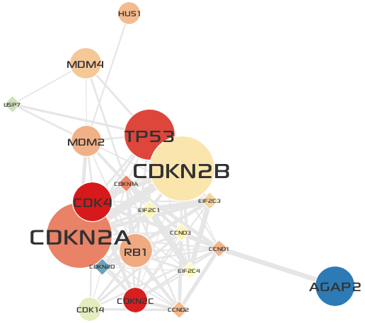

**********************************
Functional annotation of a cluster
**********************************

In this step, you will perform a GO :doc:`../network_analysis/enrichment_analysis` for genes in ``Cluster 3`` and visually annotate the cluster with representative functions via the :doc:`Visual Editor UI <../network_visualization/visual_editing>`.

.. important:: Make sure you select the **Network** tab of ``Cluster 3``.

* Select the :menuselection:`Window --> Enrichment Analysis`.

 .. image:: ../images/enrich_analysis_win.png

* Before proceeding to remaining steps, you need to import :download:`symbol2uniprot_all.csv </assets/symbol2uniprot_all.csv>` into the **node table**. The reason is that our in-house GO over-representation analysis tool expects IDs of gene set to be UniProt Accessions.

  #. Select :menuselection:`File --> Import --> Attributes from CSV File` as described in previous section.
  #. In the **Import Attributes** dialog,
  
    * Choose a **CSV file to import**: :download:`symbol2uniprot_all.csv </assets/symbol2uniprot_all.csv>`
    * **Key Column in Annotation File:** ``HGNC.symbol``
    * **Key Attribute in Network:** ``hgnc_symbol``
    
     .. image:: ../images/import_uniprot.png

* In the **Enrichment Analysis** window,

  1. Choose ``Gene Ontology`` in the drop-down list.
  2. Set **Gene ID column** to ``UniProt.Ac``.
  3. Set the multiple testing **Correction method** to ``Bonferroni``.
  4. Click the **Run** button.
  
   .. image:: ../images/enrich_analysis_run.png

* After a little, the result is shown in the **Enrichment** window at the bottom of main application.

  * You can see that GO terms of ``cell cycle checkpoint`` and ``DNA damage checkpoint`` are listed in first and second rows respectively.
  * Select the ``cell cycle checkpoint`` GO term, the click |info-icon| icon to see the details about the term.
  
   .. image:: ../images/enrich_analysis_result.png

* Next you will visually annotate the group node of ``Cluster 3`` with two representative functions.
  
  .. important:: Now be sure to select the network tab named ``tcga_gbm_edges``.
  
  * Click the group node of cluster ``3`` in the original GBM-altered network.
  * In the **Editor** window,
  * Click the ``...`` icon in **Name** property to edit a group name.
  * Enter ``DNA damage response`` and ``Cell Cycle``.
  * Set the **Font** property to ``Droid Serif 80 Bold`` or what you want. (You can open the font chooser by clicking ``...`` button in the **Font** property)
  
   .. image:: ../images/group_name_edit.png

* The result is shown below:

 .. image:: ../images/group_name_result.png

