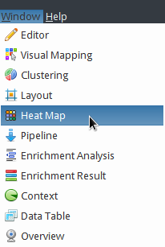

*********************************************
Import expression profiles for 4 GBM subtypes
*********************************************

Now overlay average gene expressions in GBM patients of 4 subtypes onto the GBM-altered network.

* Select the original GBM-altered network tab named ``tcga_gbm_edges``.
* Select :menuselection:`&Window --> Heat Map`.

* In the just opened **Heat Map** window, click the **Load heatmap data...** label.

* In the **Import** dialog,

  1. Choose :download:`tcga_gbm_subtypes.csv </assets/tcga_gbm_subtypes.csv`> file to import.
  2. Make sure that **Key column to map** is ``hgnc_symbol``.
  3. Be sure to check **First line in the file contains header names**.
  4. Click the **OK** button.
  .. image:: ../images/heatmap_import.png

* Now your screen looks like the following:
.. image:: ../images/F1A.png

* In the bottom panel of application,

  * Drag the slider tick to **Mesenchymal** to see average expressions in patients of ``mesenchymal`` subtype.
  * You can switch subtypes automatically to see animated pictures by clicking |play-icon| button.

.. tip:: You can clear the heatmap and mapped colors in the network by clicking |clear-icon| button in the **Heat Map** window.

