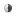

********************************************
Import expression log2FCs in normal vs. tumor 
********************************************

You will import gene expression log2FCs between normal vs. tumor condition in all TCGA GBM patients. and map them to the colors of nodes.

* Select the **Network** tab of previously created network from ``Cluster 3`` in the original network.

 .. image:: ../images/new_graph_tp53.png

* Select :menuselection:`File --> Import --> Attributes from CSV File`.

 .. image:: ../images/import_attr_menu.png

* In the **Import Attributes** dialog,

  1. Be sure **Attributes for:** ``Node`` to be checked.
  2. Choose a **CSV file to import**: :download:`tcga_gbm_exp_log2fc.csv </assets/tcga_gbm_exp_log2fc.csv>`
  3. Check **The first line in a CSV file contains column names**
  4. **Key Column in Annotation File:** ``Gene_Symbol``
  5. **Key Attribute in Network:** ``hgnc_symbol``
  6. Click the **OK** button.
  
   .. image:: ../images/import_attr_dialog.png

* Now you can see a newly added column ``log2FC`` in the node table as shown in below:

 .. image:: ../images/import_attr_col.png

* In the **Visual Mapping (Nodes)** window,

  1. Click |color-icon| icon.
  2. Choose ``log2FC`` in the drop-down list.
  3. Click |pallet-icon| to show up a palette chooser.
  4. Select |ryb-icon| (Red-Yellow-Blue).
  5. Click |invert-icon| to map ``Red`` to the **maximum** and ``Blue`` to the **minimum** value.
  6. Check |list-icon| to show a list of node names with their mapped colors ranked by values.
  7. Click the **Apply** button.
  
   .. image:: ../images/log2fc_to_color.png

* The final network of ``Cluster 3`` is shown below:

 .. image:: ../images/tp53_network_log2fc.png

* Repeat above steps on the network of ``Cluster 5``.

.. tip:: How to add more gradiation points and colors.
  
  **Writing in progress**

.. |color-icon| image:: ../images/color_icon.png

.. |list-icon| image:: ../images/list_icon.png

