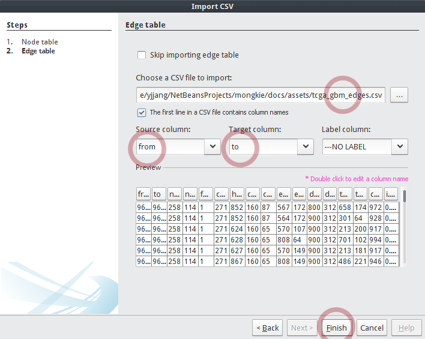

****************************
Import a GBM-altered network
****************************
To import a GBM-altered network from 2 CSV files for nodes and edges,

* Select :menuselection:`File --> Import --> Comma-Separated Values (CSV)`, then a wizard window will guide you to remaining steps.

.. image:: ../images/import_csv_menu.png

* Choose :download:`tcga_gbm_vertices.csv </assets/tcga_gbm_vertices.csv>`, and set **ID column** to ``name``, **Label column** to ``hgnc_symbol``, then click the **Next** button.

* Choose :download:`tcga_gbm_edges.csv </assets/tcga_gbm_edges.csv>`, and set **Source column** to ``from``, **Target column** to ``to``, then click the **Finish** button.

* A report dialog finally shows the summary of the imported graph, including number of nodes and edges, type of graph, issues occurred during the importing process etc. Click the **OK** button.

