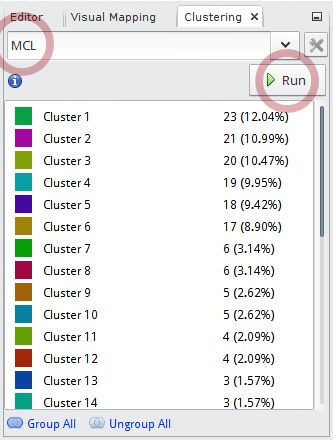
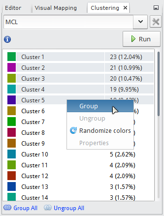
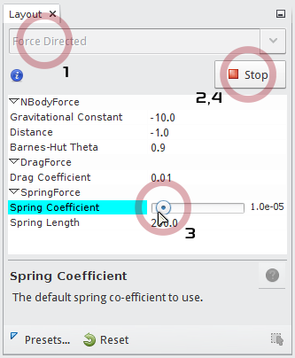
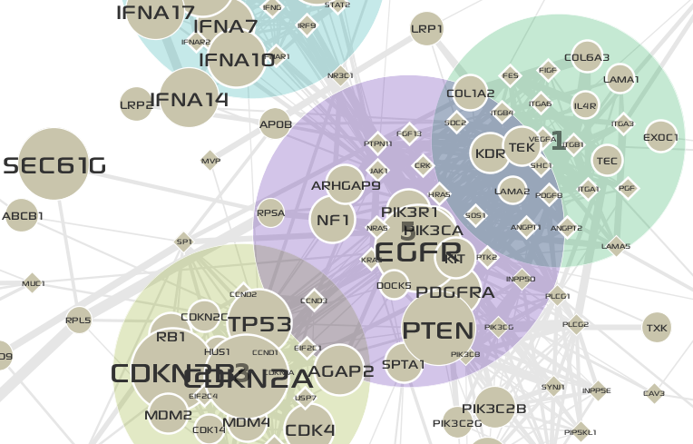

******************
Network clustering
******************

You imported the GBM-altered network into MONGKIE, now you will apply the MCL :doc:`../network_analysis/network_clustering` algorithm to identify network modules representing genes with topological proximity and correlated expression.

* In the **Clustering** window at the top-left of main application, choose the ``MCL`` algorithm, then click the |run-button| button. After a little, clusters will be listed like the following:

* You can define clusters as group nodes on the network view.

  1. Select top 5 largest clusters by clicking ``Cluster 1`` and ``Cluster 5`` holding down :kbd:`Shift` key.
  2. Right-click on the selection will show up a pop-up menu. Click the **Group** menu item.

* Now you see that group nodes on the network are too large or a lot of overlappping with each other. You can use the force-directed algorithm to lay out them with more optimized size and position.

  1. In the **Layout** window at the bottom-left of main application, choose ``Force Directed`` algorithm.
  2. Click the |run-button| buttton to start the algorithm.
  3. Set ``Spring Coefficient`` to minimu value ``4.0E-5`` by dragging the slider tick to the left-most.
  4. When being satisfied with the result, you can stop the algorithm by clicking the |stop-button| button.

* The final network looks like the following:

.. |run-button| image:: ../images/run_button.png

