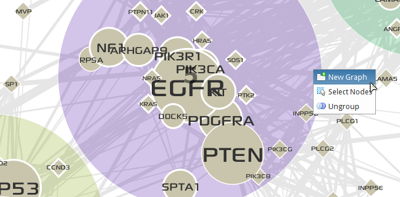
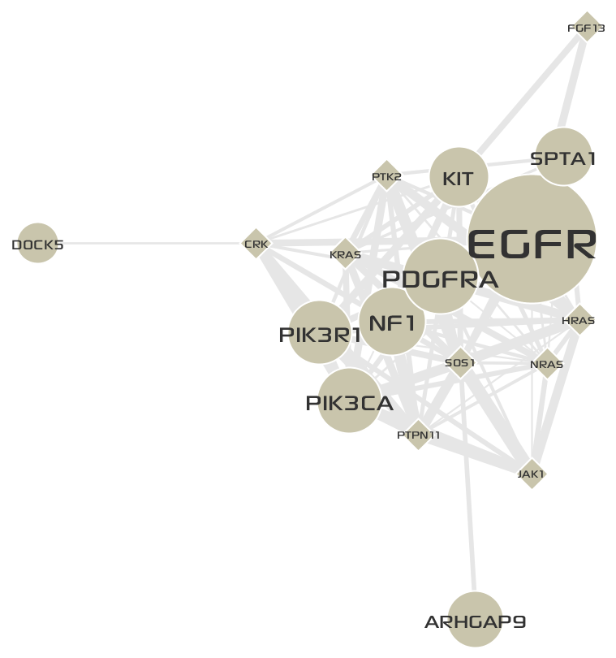
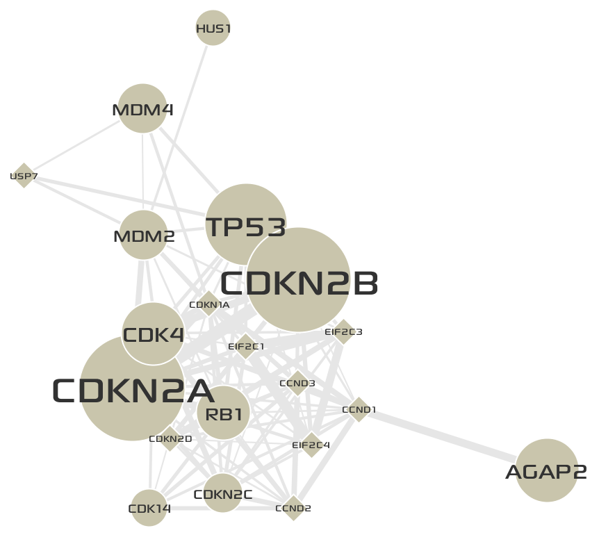

*********************************
Make a new network from a cluster
*********************************

In this step, you will create new networks from previously identified clusters. A new network consists of nodes and edges only in the cluster it derived from.

* **Right-click** on the group node for cluster ``5`` on the network, then a pop-up menu for the group node will be shown up.

* Click the **New Graph** menu item. You will see a new network created in a new tab.
* Repeat above steps on the cluster ``3``. Two networks derived from ``Cluster 5`` and ``Cluster 3`` are shown below:

