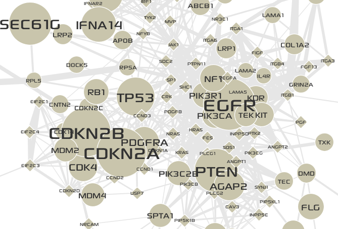

**********************
Data-to-Visual mapping
**********************

:doc:`Data-to-Visual mapping <../network_visualization/visual_editing>` allows you to map data attributes of nodes or edges to various visual styles.

* (Optional) Before proceeding to further steps, change the default font for nodes to ``Sony Sketch EF`` that was used in figures in the :doc:`../case_study`.
  
  .. note:: To use the ``Sony Sketch EF`` font, you should download and install it on your system. It is available at `here <http://www.fonts2u.com/sony-sketch-ef.font>`_.
  
  * To open the **Display Options** panel, click the **up-arrow button** in the bottom-right of a network display window.
  * Select the **Nodes** tab, and click the **Font name** button, and choose a font *name*, *style*, and *size*, then click the **OK** button.
  * To close the **Display Options** panel, click the **down-arrow button** in the top-right of the panel.

.. image:: ../images/change_nodes_font.png

* To map the alteration freq. of genes to the sizes of nodes,

  1. Select the **Visual Mapping** window at the top-left of the main application.
  2. Select the **Nodes** tab button.
  3. Select the |size-icon| icon.
  4. In the drop-down list, choose the ``Freq`` data attribute to map.
  5. Click the **Spline...** button to open the **Spline Editor**.
  6. Choose a pre-defined scale function.
  7. Adjust the transform scale to make more frequently altered genes be magnified.
  8. Close the **Spline Editor**.
  9. **Apply** the data-to-visual mapping.

* Now the network looks like the following:

* Now you will map different shape to :abbr:`linker (Not altered genes but extracted guilt-by-association)` nodes using the discrete Data-to-Visual mapping.

  1. Select the **Discrete** tab at the bottom of the **Visual Mapping** window.
  2. Choose the ``Type`` data attribute of **Nodes** to map in the drop-down list.
  3. Expand the ``LINKER``, now various editors for visual styles will be shown.
  4. In the **Shape** filed, click the ``...`` button to show up the node shape chooser.
  5. Choose the ``Diamond`` shape, and click the **OK** button.

.. image:: ../images/type_to_node_shape.png

* Now the network looks like the following:

.. image:: ../images/type_to_node_shape_result.png

* You can map :abbr:`expression correlations (Correlations of expression levels between each pair of genes in tumor conditions)` to the thicknesses of edges.

  1. Select the **Continuous** tab at the bottom of the **Visual Mapping** window.
  2. Select the **Edges** tab button.
  3. Select the |size-icon| icon.
  4. In the drop-down list, choose the ``i.weight`` data attribute to map.
  5. Set the **Max** value to ``10``.
  6. Click the **Spline...** button to open the **Spline Editor**.
  7. Restore the scale function to the linear function.
  8. **Apply** the data-to-visual mapping.

* The final network is shown below:

.. |size-icon| image:: ../images/size_icon.png

