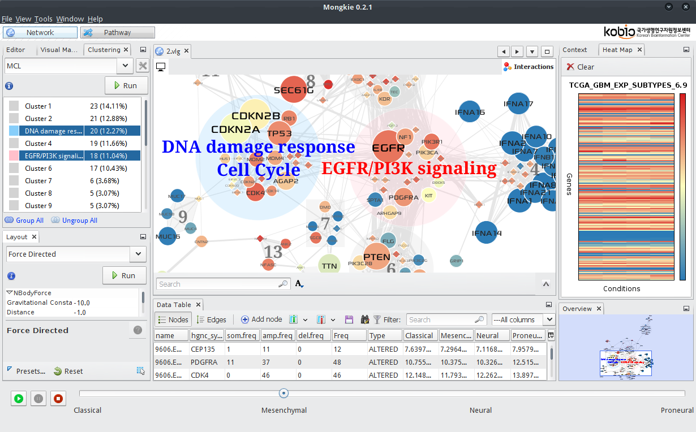

**************
User Interface
**************

:numref:`user-interface` illustrates the main graphical user interface of MONGKIE. The main application window is made up of several dynamic views using the `NetBeans <http://netbeans.org>`_ window system that lets the user maximize and minimize, dock and undock, auto-hide and sliding, and drag-and-drop windows for well organizing views inside the main window.

    
    Graphical User Interface of MONGKIE
    
    The Graphical User Interface (GUI) consist of a main visualization display with other windows, including analysis windows (network clustering, expression overlay, and enrichment analysis), visual editor, data-to-visual mapping window, data tables, statistics view, and an overview window.

The network visualization window is placed in the center with many context-sensitive menu items which allow users to easily communicate with other windows in an interactive way, access to currently important functionalities. Views in the left side of the main window includes GUIs for those functionalities that require user's input or control actions, such as visual editor, data-to-visual mapping, network clustering, enrichment analysis, and graph layout. Those in the right side display a variety of contextual informations, including overview of the complete network, properties of selected nodes or edges, heat map visualization for gene expression data, and graphical charts that show various statistics in the visualization - e.g. groups or clusters in the network, node visibility after filtering etc. Those views that need to be organized in a tabular format together with search and filtering functionalities, such as the list of nodes or edges in the network, the result of enrichment analysis, are placed in the bottom of the main window.

While other views exists only once, the network visualization window can have multiple instances for different visualizations. This allows users to in parallel compare any number of visualized networks from different conditions, e.g. gene expression levels from multiple experiments (See :doc:`./network_analysis/expression_overlay`), by tiling multiple visualization windows of the same network in a grid, where each one visualizes the information for its own condition.

Settings of the windows in the application, such as the size, position, and arrangement, are fully customizable by resizing or drag-and-drop. The flexibility of window management facilitates coherently working with multiple windows or views for the process of network visualization, navigation, or analysis. Also, these window settings are persisted across restart of the application, and later one can restore them to default settings.

Many parts of UI components and UX (User eXperiences) in MONGKIE are strongly inspired by `Gephi <http://gephi.org>`_ (:ref:`Bastian et al., 2009 <BaHJ09>`). We also use the Prefuse (:ref:`Heer et al., 2005 <Heer05>`) java library for the graph data structure and interactive visualization.
